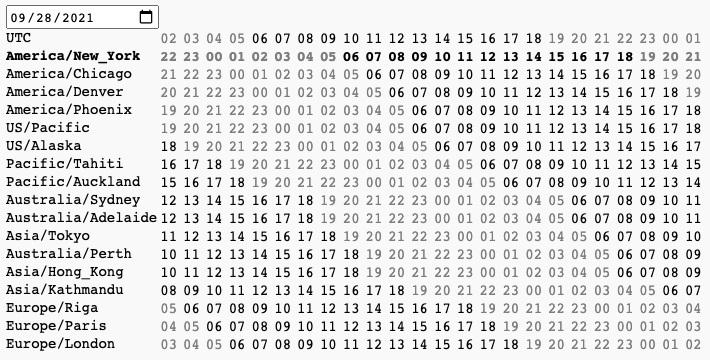

# \<t-zones>

Provides a view of times in different time zones for 24 hours on a date of choice.

This webcomponent follows the [open-wc](https://github.com/open-wc/open-wc) recommendation.



Demo at https://datadavev.github.io/t-zones

Source at https://github.com/datadavev/t-zones

## Installation

```bash
npm i t-zones
```

## Usage

```html
<script type="module">
  import 't-zones/t-zones.js';
</script>

<t-zones></t-zones>
```

or using a CDN:

```html
<script type="module" src="https://unpkg.com/t-zones/t-zones.js?module">
</script>

<t-zones></t-zones>
```


## Linting and formatting

To scan the project for linting and formatting errors, run

```bash
npm run lint
```

To automatically fix linting and formatting errors, run

```bash
npm run format
```

## Testing with Web Test Runner

To execute a single test run:

```bash
npm run test
```

To run the tests in interactive watch mode run:

```bash
npm run test:watch
```

## Demoing with Storybook

To run a local instance of Storybook for your component, run

```bash
npm run storybook
```

To build a production version of Storybook, run

```bash
npm run storybook:build
```


## Tooling configs

For most of the tools, the configuration is in the `package.json` to minimize the amount of files in your project.

If you customize the configuration a lot, you can consider moving them to individual files.

## Local Demo with `web-dev-server`

```bash
npm start
```

To run a local development server that serves the basic demo located in `demo/index.html`
